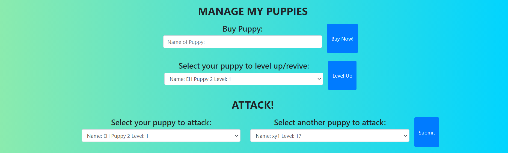

## Puppies Attack Blockchain Project
In Puppies Attack, users get to own their very own UNIQUE puppies. Other than being a cutie pie, their puppy can attack other puppies in hopes of gaining extra levels.

Every puppy is stored in ethereum's ropsten blockchain, ensuring security and immutability.

## Instructions
To run the program on your computer, simply follow the instructions below after `forking / cloning` from this repo.

### Running the Program
1. Install the relevant dependencies on the main folder by running `npm install`.</li>
2. Install the relevant dependencies on the sub folder called 'client'. Start by changing directory to 'client' by entering `cd client`. Then run `npm install`.
3. Run `npm start` to deploy the project locally.</li>
4. Enter your Metamask account password and `change to the ropsten network` to interact with the Puppies Attack Project.

### Redeploying the Smart Contract on the Ropsten Network
1. Ensure that you have the installed necessary dependencies globally : truffle. If not, run `npm install -g truffle`.
2. Store your wallet seed phrase / MNEMONIC for your Metamask account in the `.env` file.
3. Run `truffle migrate --network ropsten_infura --reset` to redeploy the smart contract on a new blockchain.

## Images of the Web Application

## Contributer:
- Low En Hao (https://github.com/enhao25)
- Xin Ying (https://github.com/Hawayo)
- Hans Sebastian (https://github.com/hansebastian)
- Suther David Samuel (https://github.com/Samuel787)
- Simon Tay (https://github.com/simonteozw)
